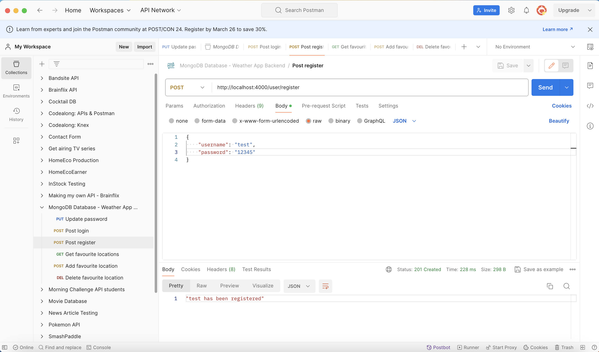
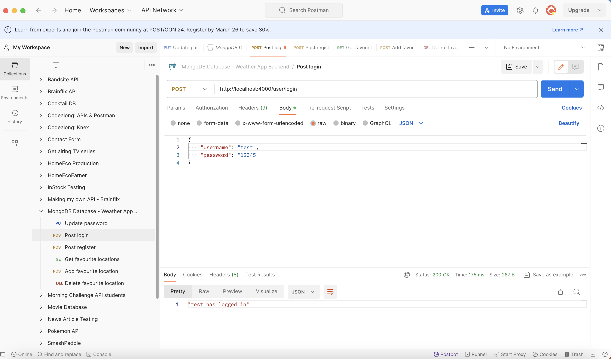
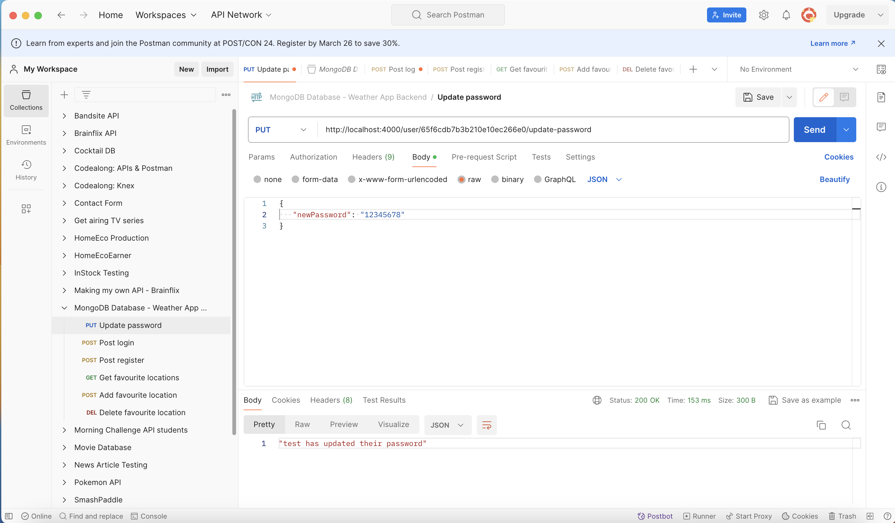
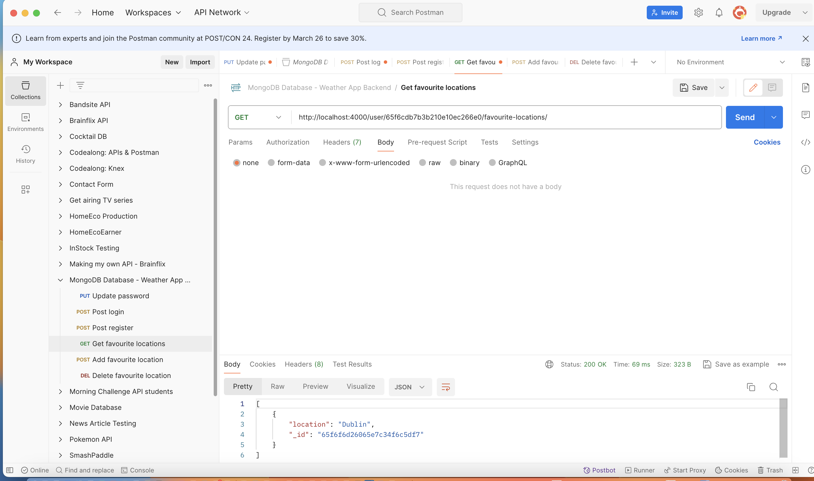
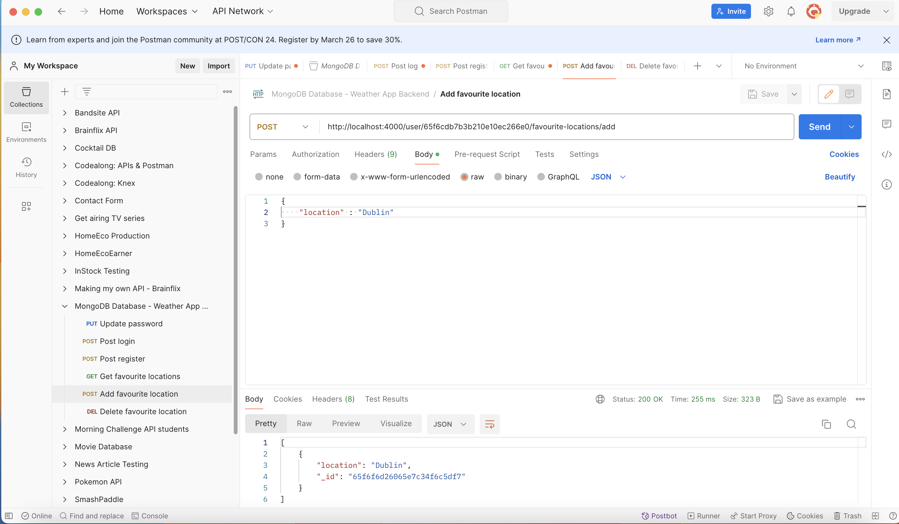
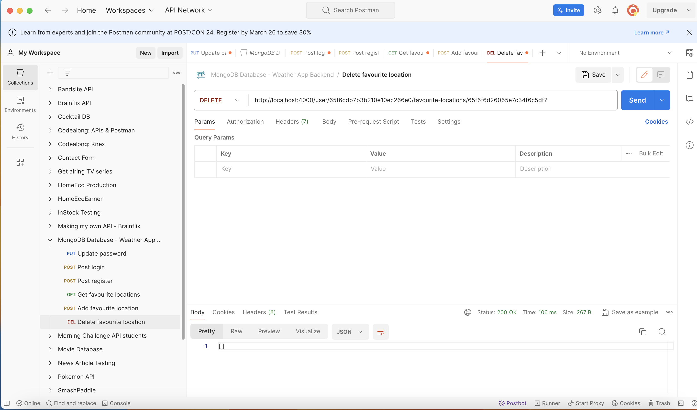

# Postman Tests

<h2>User requests</h2>

- Register a user

- User login

- Update user password

<h2>Favourite location requests</h2>

- Get favourite locations

- Add favourite location

- Delete favourite location

