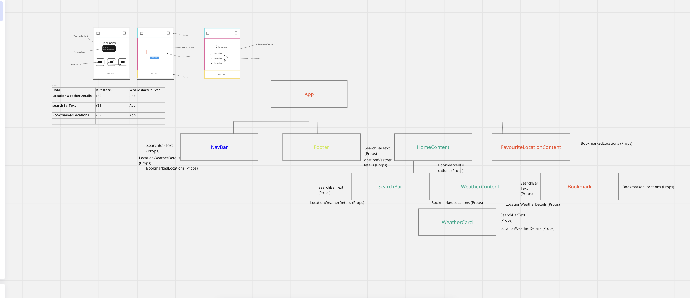

# User Stories and Class Hierarchies

**User Stories Screenshots**

**Component Hierarchy Screenshots**

**State reasoning explained**

<h3>searchBarText State - App component</h3>

- Since the searchbarText state is used in both the Navbar and HomeContent components, holding it in the App component allows for sharing and synchronisation between these components.

- As users can input a variation of locations in the search bar, having the state in the App component ensures that any changes are accessible to both the Navbar and HomeContent for initiating searches.

- Centralising the searchBarText state provides a single source of truth. It helps to avoid any inconsistencies that may arise from maintaining different state copies in several components.

<h3>locationWeatherData State - App component</h3>

- The locationWeatherData state is used to render weather information from both the HomeContent and NavBar components in their search inputs. This ensures consistent rendering across the application.

- Sharing the locationWeatherData allows for more efficient data fetching. It can be stored at the top-level and shared amongst components as needed.

- By storing this data at a top-level component, the applciation can avoid redundant API calls. If a user was to switch between components, the data can be reused without fetching it again.

<h3>bookmarkedLocations State - App component</h3>

- Since bookmarks can be added from both the Navbar (in the dropdown list) and the HomeContent from clicking a bookmark icon, keeping this state in the App ensures a unified approach to managing the bookmarks state.

- Changes to the bookmarkedLocation state in one part of the application (such as clicking on the bookmark icon in the HomeContent) should immeadiately reflect in the Navbar Dropdown list and further in the Saved Locations page. 

- Handling the bookmark state addition and deletion centrally in the App simplifies the codebase. Both the HomeContent and the Saved Locations Page trigger actions which modify the state.

